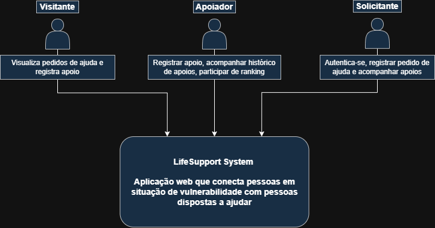
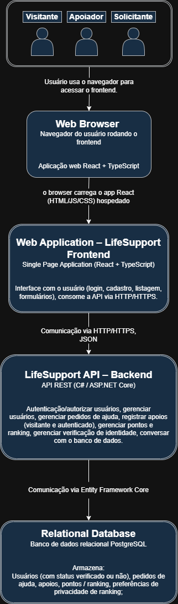

# Arquitetura do LifeSupport

## 1. Visão geral da solução

O **LifeSupport** é um sistema web que permite:

- que pessoas em situação de vulnerabilidade criem **pedidos de ajuda** (financeira, material ou outro tipo de suporte);
- que outras pessoas, inclusive visitantes, **ofereçam apoio** a esses pedidos;
- que solicitantes passem por um processo de **verificação de identidade**, aumentando a confiança nos pedidos publicados;
- que doadores autenticados acumulem **pontos** com base nos apoios realizados, podendo aparecer (ou não) em **rankings de destaques**, respeitando configurações de privacidade.

A solução é composta por:

- uma aplicação web (frontend) acessada via navegador;
- uma API (backend) que expõe os serviços necessários;
- um banco de dados para persistência de usuários, pedidos de ajuda, apoios, pontos e informações de verificação de identidade.

## 2. Tecnologias escolhidas

### 2.1. Frontend

- **React**  
  Biblioteca JavaScript amplamente utilizada para construção de interfaces de usuário baseadas em componentes, facilitando a criação de interfaces reativas e reutilizáveis.

- **TypeScript**  
  Superset do JavaScript que adiciona tipagem estática, auxiliando na detecção de erros em tempo de desenvolvimento e na manutenção do código.

- **Ferramentas auxiliares (previstas)**  
  - Gerenciador de pacotes: npm ou yarn;
  - Ferramentas de build/bundling (ex.: Vite, Create React App, ou similar);
  - ESLint/Prettier para padronização de código (opcional, mas recomendado).

### 2.2. Backend

- **C# com ASP.NET Core**  
  Framework moderno para desenvolvimento de APIs e aplicações web em C#.  
  Será utilizado para implementar uma **API REST**, responsável por:

  - autenticação e autorização de usuários;
  - gerenciamento de pedidos de ajuda;
  - registro de apoios (visitantes e usuários autenticados);
  - cálculo e armazenamento de pontos;
  - fornecimento de dados de ranking;
  - fluxo de verificação de identidade dos solicitantes;
  - comunicação com o banco de dados.

### 2.3. Banco de dados

- **Banco relacional** (PostgreSQL)  
  Justificativas:
  - facilidade de modelagem de entidades relacionadas (usuário, pedido, apoio, pontuação);
  - suporte a consultas estruturadas (SQL);
  - boa integração com ORM em C# (ex.: Entity Framework Core).

### 2.4. Outras considerações

- **Comunicação Frontend–Backend**  
  Será feita via HTTP/HTTPS, com o frontend consumindo endpoints REST do backend, utilizando JSON como formato de troca de dados.

- **Controle de versão**  
  - Git + GitHub.

- **Gestão de tarefas**  
  - GitHub Projects.

## 3. Modelo C4

### 3.1. Diagrama de Contexto (Nível 1)

O Diagrama de Contexto apresenta o **LifeSupport** como um sistema único e mostra como diferentes tipos de usuários interagem com ele.

### 3.2. Diagrama de Contêineres (Nível 2)

O Diagrama de Contêineres detalha os principais blocos (contêineres) que compõem o **LifeSupport** e como eles se comunicam.

## 4. Justificativa da arquitetura

A arquitetura proposta segue o padrão **cliente-servidor**, separando claramente:

- a camada de apresentação (**frontend**, em React + TypeScript);
- a camada de lógica de negócio e acesso a dados (**backend**, em C# / ASP.NET Core);
- a camada de persistência (**banco de dados** relacional).

Essa abordagem é adequada ao LifeSupport porque:

1. **Atende ao escopo do trabalho**  
   - O projeto exige uma solução com mais de um componente (não apenas frontend);
   - A separação em frontend + backend facilita o cumprimento dos requisitos de autenticação, verificação de identidade, registro de apoios, pontuação e ranking.

2. **Facilita a manutenção e evolução**  
   - A interface pode evoluir independentemente da API;
   - Novas funcionalidades (por exemplo, integração com serviços de pagamento ou envio de e-mails) podem ser adicionadas no backend sem impacto direto na estrutura do frontend.

3. **Escalabilidade**  
   - O backend pode ser escalado de forma independente do frontend;
   - O uso de uma API REST permite, no futuro, que outros clientes (por exemplo, aplicativos mobile) consumam os mesmos serviços.

4. **Aproveitamento de tecnologias consolidadas**  
   - **React + TypeScript** permitem uma interface rica, tipada e mais segura em tempo de desenvolvimento;
   - **C# / ASP.NET Core** é um stack maduro e com bom suporte para construção de APIs robustas;
   - Bancos relacionais são adequados ao modelo de dados do LifeSupport (usuários, pedidos, apoios, pontos, etc.).

5. **Organização e clareza para o projeto da disciplina**  
   - O uso do modelo C4 ajuda a documentar a solução em diferentes níveis de detalhe;
   - A arquitetura fica compreensível tanto para professores quanto para outros desenvolvedores que venham a contribuir com o projeto.
