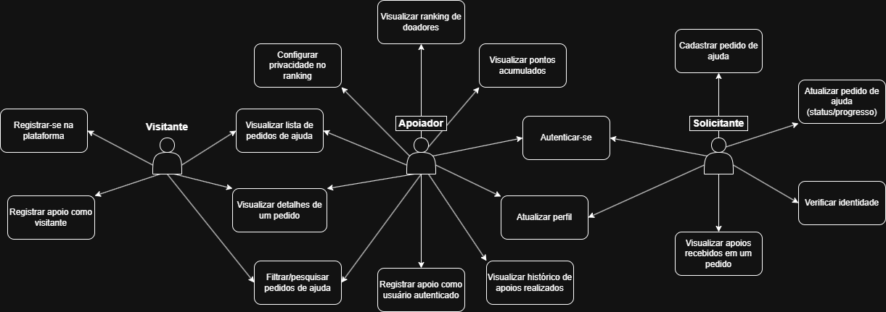

# Casos de Uso – LifeSupport

Este documento descreve os principais **atores** e **casos de uso** do sistema LifeSupport, bem como o diagrama de casos de uso correspondente.

---

## 1. Atores

- **Visitante**  
  Usuário não autenticado que acessa a aplicação para visualizar pedidos de ajuda e pode registrar apoios simples sem criar conta.

- **Usuário autenticado**  
  Usuário que possui conta e está autenticado no sistema. Um usuário autenticado pode:

  - criar pedidos de ajuda (atuando como **Solicitante**);
  - apoiar pedidos de ajuda (atuando como **Apoiador/Doador**);
  - exercer ambas as funções ao mesmo tempo.

Para fins de clareza, neste documento vamos nos referir aos papéis:

- **Solicitante** – usuário autenticado que cria e gerencia pedidos de ajuda;
- **Apoiador (Doador)** – usuário autenticado que registra apoios a pedidos de ajuda.

---

## 2. Casos de uso

### 2.1. Visitante

**UC01 – Visualizar lista de pedidos de ajuda**  
O Visitante acessa a aplicação e visualiza uma lista de pedidos de ajuda disponíveis, com informações resumidas.

**UC02 – Visualizar detalhes de um pedido de ajuda**  
O Visitante seleciona um pedido de ajuda na lista e visualiza suas informações completas (descrição, tipo de ajuda, localidade, status, etc.).

**UC03 – Registrar apoio como visitante**  
O Visitante seleciona um pedido de ajuda e registra um apoio sem criar conta, informando:
- tipo de apoio (financeiro, material, outro);
- valor estimado (quando aplicável);
- nome opcional para aparecer junto ao apoio;
- mensagem opcional ao Solicitante.

**UC04 – Registrar-se na plataforma**  
O Visitante cria uma conta informando seus dados básicos (por exemplo, nome, e-mail e senha), tornando-se um Usuário autenticado.

---

### 2.2. Usuário autenticado (papel geral)

**UC05 – Autenticar-se**  
O Usuário autenticado realiza login na plataforma utilizando e-mail e senha.

**UC06 – Atualizar perfil**  
O Usuário autenticado visualiza e atualiza seus dados básicos de perfil.

**UC07 – Filtrar/pesquisar pedidos de ajuda**  
O Usuário autenticado aplica filtros ou realiza buscas na listagem de pedidos de ajuda (por palavra-chave, tipo de ajuda, localidade, status).

---

### 2.3. Solicitante

**UC08 – Cadastrar pedido de ajuda**  
O Solicitante registra um novo pedido de ajuda, informando título, descrição, tipo de ajuda, valor estimado (quando aplicável), localidade e, opcionalmente, links ou referências adicionais.

**UC09 – Verificar identidade**  
O Solicitante fornece informações adicionais e documentos para que sua identidade seja verificada (por exemplo, envio de dados pessoais e imagem de documento).  
Após a análise, sua conta passa ou não a ser marcada como “verificada”.

> Regra de negócio: apenas Solicitantes verificados poderão ter seus pedidos de ajuda publicados/visíveis para outros usuários.

**UC10 – Atualizar pedido de ajuda**  
O Solicitante atualiza um pedido de ajuda que criou, podendo:
- alterar algumas informações (quando o fluxo de negócio permitir);
- atualizar o status (Aberto, Em andamento, Concluído);
- adicionar mensagens de atualização sobre o progresso da situação.

**UC11 – Visualizar apoios recebidos em um pedido**  
O Solicitante visualiza os apoios realizados ao seu pedido, incluindo tipo de apoio, valor estimado (quando aplicável) e mensagens enviadas pelos apoiadores (visitantes ou autenticados).

---

### 2.4. Apoiador (Doador) autenticado

**UC12 – Registrar apoio como usuário autenticado**  
O Apoiador seleciona um pedido de ajuda e registra um apoio, informando:
- tipo de apoio (financeiro, material, outro);
- valor estimado (quando aplicável);
- mensagem opcional ao Solicitante.

Esse apoio gera pontos vinculados à conta do Apoiador.

**UC13 – Visualizar histórico de apoios realizados**  
O Apoiador visualiza a lista de apoios que já realizou na plataforma.

**UC14 – Visualizar pontos acumulados**  
O Apoiador visualiza o total de pontos que possui na plataforma e, quando disponível, um resumo de como esses pontos foram acumulados.

**UC15 – Visualizar ranking de doadores**  
O Apoiador (ou outro usuário autenticado) acessa uma área da aplicação onde são exibidos os destaques (por exemplo, doadores com mais pontos no mês), respeitando as configurações de privacidade de cada doador.

**UC16 – Configurar privacidade no ranking**  
O Apoiador configura se deseja:
- aparecer publicamente no ranking/destaques; ou
- permanecer anônimo/oculto.

Essa escolha deve ser respeitada em todas as visualizações de ranking.

---

## 3. Diagrama de casos de uso

O diagrama de casos de uso do **LifeSupport** representa graficamente as interações entre:

- os atores: Visitante, Solicitante, Apoiador (Doador);
- os casos de uso descritos anteriormente (UC01 a UC16).

Esse diagrama servirá de base para:

- o **projeto de arquitetura** (SPT2, modelo C4);
- a **definição de casos de teste** (SPT4 e SPT5).
